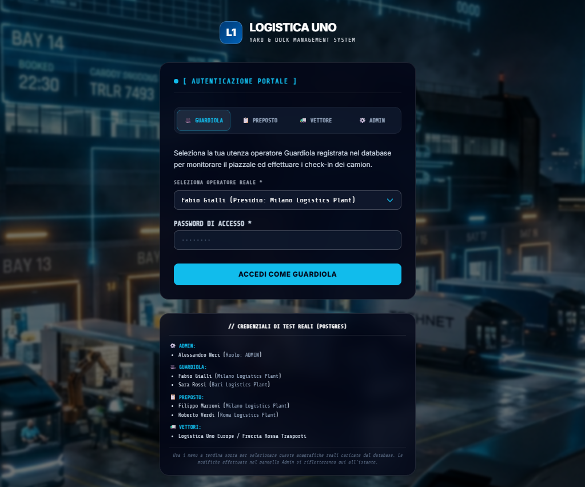
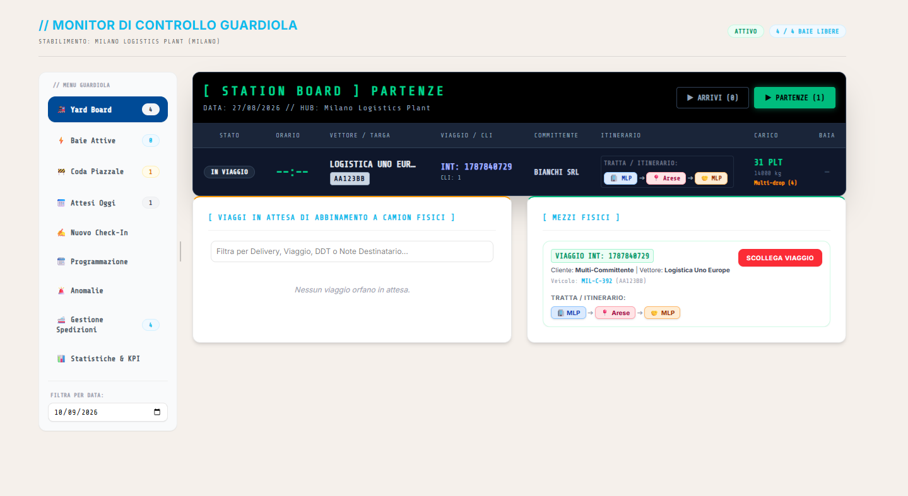
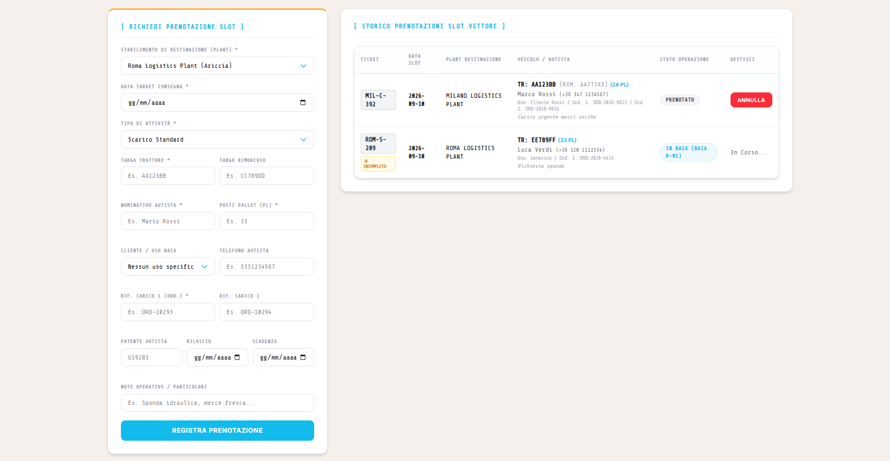
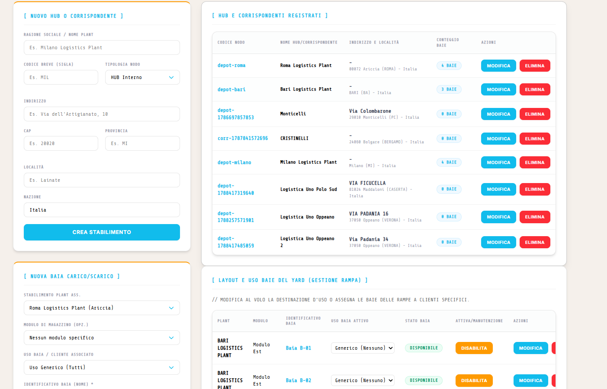
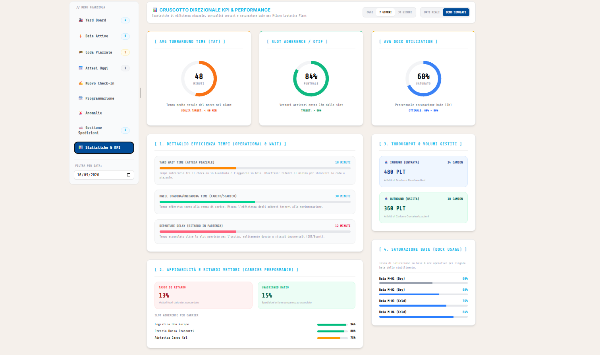
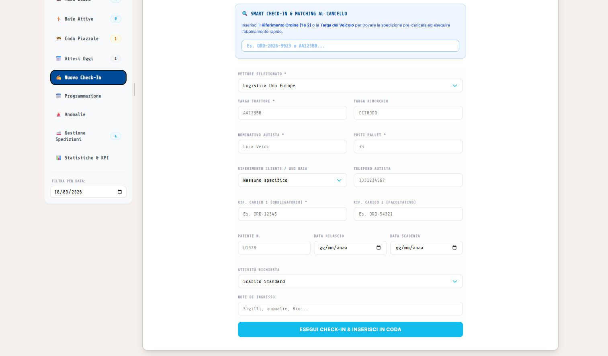

# Documentazione Progetto: Gestione Baie e Yard Management

## Introduzione
**GestioneBaie** è un portale enterprise per la gestione delle baie di carico/scarico e del piazzale (Yard and Dock Management), sviluppato specificamente per le esigenze operative di Logistica Uno Europe. 

L'obiettivo principale del sistema è quello di orchestrare e tracciare in tempo reale le operazioni di check-in dei veicoli al cancello, l'assegnazione delle baie e le operazioni di carico/scarico, migliorando i tempi di turnaround del piazzale.

## Stack Tecnologico
Il progetto è sviluppato come un'applicazione Web (Single Page Application) moderna:
- **Frontend Framework**: React (v18/19) con TypeScript per la tipizzazione statica.
- **Build Tool**: Vite, per un'esperienza di sviluppo rapida e build ottimizzate.
- **Styling**: Tailwind CSS v4 con un approccio CSS-first, allineato alle linee guida grafiche del "Portale Ticket" (design chiaro, moderno, card semi-trasparenti, sidebar aziendale blu).
- **Gestione dello Stato & Persistenza**: React Context API con sincronizzazione su database (supporto per ambiente di sviluppo locale via `local_db.json` o backend PostgreSQL su Vercel in produzione).

## Architettura e Funzionalità Principali

### 1. Sistema di Autenticazione e Ruoli (Simulatore)
L'applicazione integra un meccanismo per lo switch rapido dei ruoli, utile per scopi operativi e dimostrativi. 

I ruoli supportati sono:
- **Guardia / Operatore di Piazzale**: Gestisce le entrate/uscite e l'assegnazione delle baie.
- **Vettore (Trasportatore)**: Inserisce e monitora le proprie prenotazioni.
- **Amministratore**: Configura il sistema, i magazzini (hub), gli utenti e approva i vettori.

### 2. Monitor Yard Live (Dashboard Operativa)
Costituisce il cuore dell'operatività del piazzale, mettendo a disposizione un Heads-Up Display (HUD) in tempo reale.

- **Gestione Interattiva Guardia-Magazzino**: Il Monitor Yard è progettato per abilitare una collaborazione sincrona tra la guardiola (al gate) e gli operatori in magazzino. Ogni variazione di stato inserita dalla guardiola (es. "Veicolo in transito verso la baia 4") è immediatamente visibile sui dispositivi degli operatori interni. Al contrario, quando il magazzino completa il carico/scarico, la guardiola viene subito notificata che il mezzo è pronto per uscire. Questo scambio continuo di informazioni elimina i tempi morti e garantisce una movimentazione dei mezzi fluida e sicura all'interno delle strutture.
- **Tabelloni Arrivi e Partenze**: Liste filtrate e dinamiche basate sull'Hub attivo e sulla tipologia della tratta.
- **Gestione Baie**: Visualizzazione dello stato (Libera, In Uso, Manutenzione) e assegnazione dinamica drag & drop visivo.
- **Registro Log (Event Stream)**: Storico live di tutte le operazioni compiute.

### 3. Portale Vettori
Un'area dedicata ai partner logistici per una comunicazione diretta e trasparente.

Permette di:
- Inserire nuove prenotazioni (indicando data, depot, tipo attività, targa e autista).
- Consultare lo storico delle prenotazioni e monitorarne lo stato d'avanzamento in tempo reale.

### 4. Amministrazione e Configurazione Multi-Depot
Il pannello amministratore consente una gestione gerarchica e centralizzata degli asset.

- **Hub e Baie**: Creazione di nuovi centri di distribuzione e definizione geografica e numerica delle baie.
- **Vettori**: Approvazione e anagrafica dei fornitori di trasporto.
- **Gestione Utenti**: Gestione degli accessi del personale interno.

### 5. Reportistica e Analisi
Il sistema espone statistiche chiave per valutare e ottimizzare le prestazioni del piazzale.

- Monitoraggio dei volumi di traffico giornalieri.
- Calcolo del tasso di occupazione delle baie.
- Tracciamento del tempo di Turnaround (tempo medio di sosta del vettore dal check-in al check-out).

## Integrazione TMS, Routing e Qualità del Check-In

Nelle fasi di sviluppo avanzato, il sistema è stato profondamente integrato con le logiche del TMS (Transport Management System). 

1. **Abbinamento Intelligente (Matching TMS)**: L'architettura supporta ora la Geografia Reale (Origine/Destinazione) e gli Hub Operativi. Il sistema non si limita a far entrare un camion, ma abbina il mezzo fisico in arrivo alle entità logistiche pre-caricate nel TMS (spedizioni e viaggi). Attraverso lo **Smart Gate**, inserendo targa o riferimento, il sistema propone automaticamente i viaggi attesi, permettendo all'operatore di instradare il veicolo verso la baia ottimale (Inbound, Outbound o Hub-to-Hub) senza errori.
2. **Qualità e Sicurezza al Check-In**: Il momento del check-in al cancello viene gestito come un vero e proprio *controllo qualità logistico*. Oltre all'identificazione del mezzo, il sistema registra lo stato del veicolo all'arrivo e la conformità documentale prima di consentire l'accesso al piazzale interno, incrementando notevolmente gli standard di sicurezza e di servizio.

## Flusso Operativo Standard
1. **Prenotazione**: Il vettore inserisce i dati della spedizione.
2. **Arrivo al Cancello**: Il veicolo si presenta in guardiola. L'operatore effettua lo Smart Check-in (con matching su TMS).
3. **Assegnazione Baia**: La guardia assegna una baia. Gli operatori di magazzino vedono in tempo reale l'assegnazione.
4. **Carico/Scarico**: Inizia l'operazione in baia.
5. **Rilascio e Uscita**: A operazione completata, la baia viene liberata dagli operatori interni e il veicolo esce dal piazzale (Turnaround time calcolato).

## Qualità del Codice e UI
L'interfaccia utente è progettata per essere chiara e responsiva, applicando palette aziendali e un design moderno e professionale (bordi arrotondati, gradienti blu). Il codice aderisce a rigidi standard di qualità: zero errori TypeScript o linter, prassi di accessibilità, verifiche di compatibilità UX e controlli di sicurezza superati con successo pre-build.
